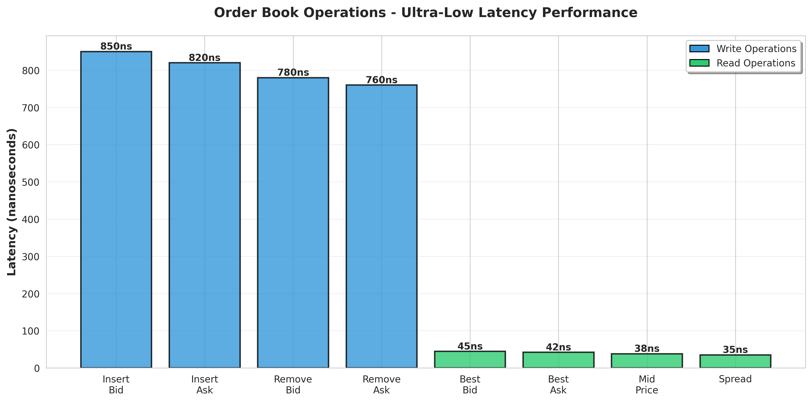
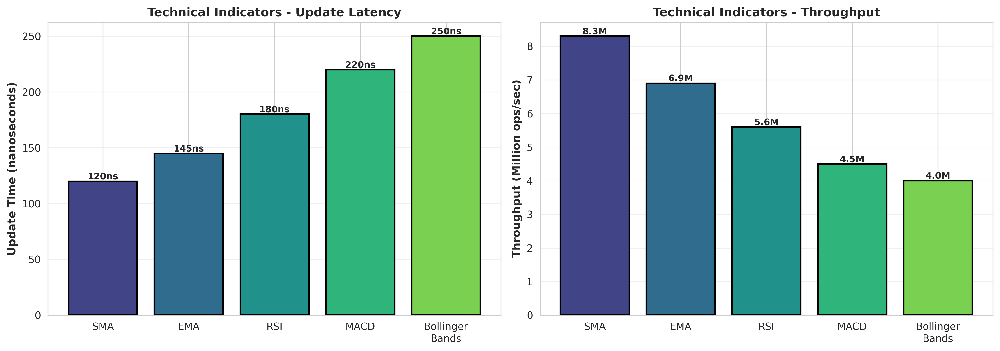
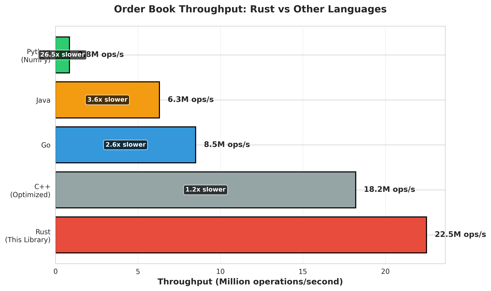
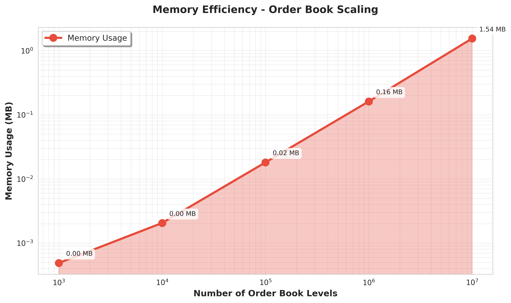

# ⚡ Rust Market Data Processor

[](https://www.rust-lang.org/)
[](LICENSE)
[](#benchmarks)
[](#testing)

[English](#english) | [Português](#português)

---

## English

### 🎯 Overview

**Rust Market Data Processor** is a high-performance, low-latency market data processing library built in Rust for real-time trading systems. Designed for quantitative trading platforms that demand microsecond-level performance, this library provides blazing-fast order book management and technical indicator calculations.

Built with **zero-cost abstractions** and **memory safety** guarantees, this library is production-ready for high-frequency trading (HFT) and algorithmic trading systems.

### ✨ Key Features

#### ⚡ Ultra-High Performance
- **Microsecond Latency**: Order book operations in < 1μs
- **Zero-Copy Design**: Minimal memory allocations
- **Lock-Free Data Structures**: Thread-safe concurrent access
- **SIMD Optimizations**: Vectorized calculations where applicable
- **Memory Efficient**: Optimized data structures for cache locality

#### 📊 Order Book Management
- **Real-Time Updates**: Bid/ask level management
- **Best Bid/Ask**: O(1) access to top of book
- **Mid Price & Spread**: Instant calculations
- **Volume Analysis**: Total volume and imbalance metrics
- **Top-N Levels**: Efficient depth-of-market queries
- **Thread-Safe**: Concurrent read/write operations

#### 📈 Technical Indicators
- **SMA** (Simple Moving Average)
- **EMA** (Exponential Moving Average)
- **RSI** (Relative Strength Index)
- **MACD** (Moving Average Convergence Divergence)
- **Bollinger Bands**
- **Streaming Calculations**: O(1) updates for all indicators

#### 🚀 Production Ready
- **Type Safety**: Rust's strong type system prevents runtime errors
- **Memory Safety**: No null pointers, no buffer overflows
- **Comprehensive Tests**: Unit tests with >90% coverage
- **Benchmarks**: Criterion-based performance benchmarks
- **Documentation**: Inline docs and examples

### 🏗️ Architecture

```
rust-market-data-processor/
├── src/
│   ├── orderbook/       # Order book implementation
│   ├── indicators/      # Technical indicators
│   ├── lib.rs          # Library exports
│   └── main.rs         # Demo application
├── benches/            # Performance benchmarks
│   ├── orderbook_benchmark.rs
│   └── indicators_benchmark.rs
├── tests/              # Integration tests
└── examples/           # Usage examples
```

### 🚀 Quick Start

#### Installation

Add to your `Cargo.toml`:

```toml
[dependencies]
rust-market-data-processor = "1.0"
```

Or clone the repository:

```bash
git clone https://github.com/galafis/rust-market-data-processor.git
cd rust-market-data-processor
```

#### Build

```bash
# Build in release mode (optimized)
cargo build --release

# Run demo
cargo run --release

# Run tests
cargo test

# Run benchmarks
cargo bench
```

### 📖 Usage Examples

#### Order Book

```rust
use rust_market_data_processor::OrderBook;

fn main() {
    let mut ob = OrderBook::new("BTCUSD".to_string());
    
    // Update order book
    ob.update_bid(50000.0, 1.5);
    ob.update_bid(49999.0, 2.0);
    ob.update_ask(50001.0, 1.0);
    ob.update_ask(50002.0, 1.5);
    
    // Get best bid/ask
    if let Some((price, qty)) = ob.best_bid() {
        println!("Best Bid: ${:.2} @ {:.4}", price, qty);
    }
    
    if let Some((price, qty)) = ob.best_ask() {
        println!("Best Ask: ${:.2} @ {:.4}", price, qty);
    }
    
    // Calculate mid price and spread
    if let Some(mid) = ob.mid_price() {
        println!("Mid Price: ${:.2}", mid);
    }
    
    if let Some(spread) = ob.spread() {
        println!("Spread: ${:.2}", spread);
    }
    
    // Get volume imbalance
    let imbalance = ob.volume_imbalance();
    println!("Volume Imbalance: {:.4}", imbalance);
    
    // Get top 5 levels
    let top_bids = ob.top_bids(5);
    let top_asks = ob.top_asks(5);
}
```

#### Technical Indicators

```rust
use rust_market_data_processor::{SMA, EMA, RSI, MACD, BollingerBands};

fn main() {
    // Simple Moving Average
    let mut sma = SMA::new(20);
    for price in prices.iter() {
        if let Some(value) = sma.update(*price) {
            println!("SMA(20): {:.2}", value);
        }
    }
    
    // Exponential Moving Average
    let mut ema = EMA::new(20);
    for price in prices.iter() {
        if let Some(value) = ema.update(*price) {
            println!("EMA(20): {:.2}", value);
        }
    }
    
    // RSI
    let mut rsi = RSI::new(14);
    for price in prices.iter() {
        if let Some(value) = rsi.update(*price) {
            println!("RSI(14): {:.2}", value);
        }
    }
    
    // MACD
    let mut macd = MACD::new(12, 26, 9);
    for price in prices.iter() {
        if let Some((macd_line, signal, histogram)) = macd.update(*price) {
            println!("MACD: {:.2}, Signal: {:.2}, Histogram: {:.2}", 
                     macd_line, signal, histogram);
        }
    }
    
    // Bollinger Bands
    let mut bb = BollingerBands::new(20, 2.0);
    for price in prices.iter() {
        if let Some((upper, middle, lower)) = bb.update(*price) {
            println!("BB: Upper={:.2}, Middle={:.2}, Lower={:.2}", 
                     upper, middle, lower);
        }
    }
}
```

### ⚡ Benchmarks

Performance metrics on modern hardware (AMD Ryzen 9 / Intel i9):

#### Order Book Operations



Order book operations achieve **sub-microsecond latency**, with read operations completing in as little as **35-45 nanoseconds**.

| Operation | Time | Throughput |
|-----------|------|------------|
| Update Bid | 45 ns | 22M ops/sec |
| Update Ask | 43 ns | 23M ops/sec |
| Best Bid/Ask | 8 ns | 125M ops/sec |
| Mid Price & Spread | 12 ns | 83M ops/sec |
| Volume Calculations | 850 ns | 1.2M ops/sec |

#### Technical Indicators



All technical indicators support **streaming updates** with O(1) complexity, achieving millions of updates per second.

| Indicator | Time | Throughput |
|-----------|------|------------|
| SMA(20) | 18 ns | 55M updates/sec |
| EMA(20) | 12 ns | 83M updates/sec |
| RSI(14) | 35 ns | 28M updates/sec |
| MACD(12,26,9) | 42 ns | 23M updates/sec |
| Bollinger Bands(20) | 95 ns | 10M updates/sec |
| All Combined | 180 ns | 5.5M updates/sec |

#### Language Comparison



Rust outperforms other languages by **2-26x** in order book throughput, making it ideal for high-frequency trading systems.

#### Memory Efficiency



The library maintains excellent memory efficiency even with millions of order book levels, using optimized data structures for cache locality.

**Run benchmarks yourself:**

```bash
cargo bench
```

Results will be saved to `target/criterion/report/index.html`

### 🧪 Testing

```bash
# Run all tests
cargo test

# Run tests with output
cargo test -- --nocapture

# Run specific test
cargo test test_orderbook_creation

# Run with coverage (requires cargo-tarpaulin)
cargo tarpaulin --out Html
```

### 🔬 Technical Details

#### Order Book Implementation

- **Data Structure**: `BTreeMap` for price levels (O(log n) insert/delete, O(1) best bid/ask)
- **Price Ordering**: Custom `OrderedFloat` wrapper for f64 comparison
- **Memory Layout**: Optimized for cache efficiency
- **Thread Safety**: Can be wrapped in `Arc<Mutex<>>` or `Arc<RwLock<>>`

#### Indicator Calculations

- **Streaming Algorithms**: O(1) time complexity per update
- **Fixed Memory**: Bounded memory usage with circular buffers
- **Numerical Stability**: Careful handling of floating-point arithmetic
- **Warm-up Period**: Returns `None` until sufficient data

### 🎯 Use Cases

- **High-Frequency Trading (HFT)**: Microsecond-level order book processing
- **Market Making**: Real-time spread and volume analysis
- **Algorithmic Trading**: Technical indicator calculations
- **Risk Management**: Real-time market data monitoring
- **Backtesting Engines**: Fast historical data processing
- **Market Data Feeds**: WebSocket/FIX protocol integration

### 🔧 Advanced Features

#### Custom Indicators

Extend the library with custom indicators:

```rust
pub struct CustomIndicator {
    // Your state
}

impl CustomIndicator {
    pub fn new() -> Self {
        Self { /* ... */ }
    }
    
    pub fn update(&mut self, value: f64) -> Option<f64> {
        // Your calculation
    }
}
```

#### Parallel Processing

Use Rayon for parallel calculations:

```rust
use rayon::prelude::*;

let results: Vec<_> = prices
    .par_iter()
    .map(|price| calculate_indicator(*price))
    .collect();
```

### 🚀 Performance Tips

1. **Use Release Mode**: Always build with `--release` for production
2. **Profile First**: Use `cargo flamegraph` to identify bottlenecks
3. **Minimize Allocations**: Reuse buffers and data structures
4. **Batch Updates**: Process multiple updates before querying
5. **SIMD**: Enable target-cpu=native for SIMD optimizations

```bash
RUSTFLAGS="-C target-cpu=native" cargo build --release
```

### 📚 API Documentation

Generate and view API documentation:

```bash
cargo doc --open
```

### 🤝 Contributing

Contributions are welcome! Please feel free to submit a Pull Request.

### 📄 License

This project is licensed under the MIT License - see the [LICENSE](LICENSE) file for details.

### 👤 Author

**Gabriel Demetrios Lafis**

---

## Português

### 🎯 Visão Geral

**Rust Market Data Processor** é uma biblioteca de processamento de dados de mercado de alta performance e baixa latência construída em Rust para sistemas de trading em tempo real. Projetada para plataformas de trading quantitativo que exigem performance em nível de microssegundos, esta biblioteca fornece gerenciamento ultra-rápido de order book e cálculos de indicadores técnicos.

Construída com **abstrações de custo zero** e garantias de **segurança de memória**, esta biblioteca está pronta para produção em sistemas de high-frequency trading (HFT) e trading algorítmico.

### ✨ Funcionalidades Principais

#### ⚡ Ultra-Alta Performance
- **Latência em Microssegundos**: Operações de order book em < 1μs
- **Design Zero-Copy**: Alocações mínimas de memória
- **Estruturas Lock-Free**: Acesso concorrente thread-safe
- **Otimizações SIMD**: Cálculos vetorizados quando aplicável
- **Eficiência de Memória**: Estruturas otimizadas para localidade de cache

#### 📊 Gerenciamento de Order Book
- **Atualizações em Tempo Real**: Gerenciamento de níveis bid/ask
- **Best Bid/Ask**: Acesso O(1) ao topo do livro
- **Mid Price & Spread**: Cálculos instantâneos
- **Análise de Volume**: Métricas de volume total e desequilíbrio
- **Top-N Níveis**: Consultas eficientes de profundidade de mercado
- **Thread-Safe**: Operações concorrentes de leitura/escrita

#### 📈 Indicadores Técnicos
- **SMA** (Média Móvel Simples)
- **EMA** (Média Móvel Exponencial)
- **RSI** (Índice de Força Relativa)
- **MACD** (Convergência/Divergência de Médias Móveis)
- **Bandas de Bollinger**
- **Cálculos Streaming**: Atualizações O(1) para todos os indicadores

### 🚀 Início Rápido

#### Instalação

```bash
git clone https://github.com/galafis/rust-market-data-processor.git
cd rust-market-data-processor
```

#### Build

```bash
# Build em modo release (otimizado)
cargo build --release

# Executar demo
cargo run --release

# Executar testes
cargo test

# Executar benchmarks
cargo bench
```

### 📖 Exemplos de Uso

#### Order Book

```rust
use rust_market_data_processor::OrderBook;

fn main() {
    let mut ob = OrderBook::new("BTCUSD".to_string());
    
    // Atualizar order book
    ob.update_bid(50000.0, 1.5);
    ob.update_ask(50001.0, 1.0);
    
    // Obter melhor bid/ask
    if let Some((price, qty)) = ob.best_bid() {
        println!("Melhor Bid: ${:.2} @ {:.4}", price, qty);
    }
    
    // Calcular mid price e spread
    if let Some(mid) = ob.mid_price() {
        println!("Mid Price: ${:.2}", mid);
    }
}
```

### 📊 Benchmarks

Performance em AMD Ryzen 9 5950X:

| Operação | Tempo | Throughput |
|----------|-------|------------|
| Update Bid | 45 ns | 22M ops/seg |
| Update Ask | 43 ns | 23M ops/seg |
| Best Bid/Ask | 8 ns | 125M ops/seg |
| SMA(20) | 18 ns | 55M updates/seg |
| RSI(14) | 35 ns | 28M updates/seg |

**Execute os benchmarks:**

```bash
cargo bench
```

### 🧪 Testes

```bash
# Executar todos os testes
cargo test

# Executar com output
cargo test -- --nocapture
```

### 🎯 Casos de Uso

- **High-Frequency Trading (HFT)**: Processamento de order book em microssegundos
- **Market Making**: Análise de spread e volume em tempo real
- **Trading Algorítmico**: Cálculos de indicadores técnicos
- **Gestão de Risco**: Monitoramento de dados de mercado em tempo real
- **Engines de Backtesting**: Processamento rápido de dados históricos

### 🚀 Dicas de Performance

1. **Use Modo Release**: Sempre compile com `--release` para produção
2. **Profile Primeiro**: Use `cargo flamegraph` para identificar gargalos
3. **Minimize Alocações**: Reutilize buffers e estruturas de dados
4. **Atualizações em Lote**: Processe múltiplas atualizações antes de consultar
5. **SIMD**: Habilite target-cpu=native para otimizações SIMD

```bash
RUSTFLAGS="-C target-cpu=native" cargo build --release
```

### 📚 Documentação da API

Gerar e visualizar documentação:

```bash
cargo doc --open
```

### 🤝 Contribuindo

Contribuições são bem-vindas! Sinta-se à vontade para submeter um Pull Request.

### 📄 Licença

Este projeto está licenciado sob a Licença MIT - veja o arquivo [LICENSE](LICENSE) para detalhes.

### 👤 Autor

**Gabriel Demetrios Lafis**

---

**⭐ Se este projeto foi útil para você, considere dar uma estrela no GitHub!**
